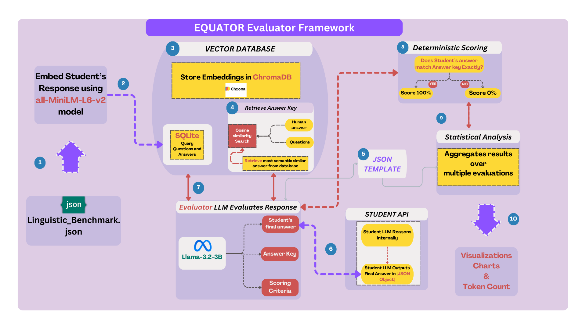

# EQUATOR Evaluator Framework



## Overview

The **EQUATOR Evaluator** is a robust framework designed to systematically evaluate the factual accuracy and reasoning capabilities of large language models (LLMs). Unlike traditional evaluation methods, which often prioritize fluency over accuracy, EQUATOR employs a **deterministic scoring system** that ensures precise and unbiased assessment of LLM-generated responses.

This repository implements the methodology described in the research paper "[EQUATOR: A Deterministic Framework for Evaluating LLM Reasoning with Open-Ended Questions. #v1.0.0-beta](https://arxiv.org/abs/2501.00257)" (Bernard et al., 2024). By leveraging vector databases and smaller, locally hosted LLMs, the EQUATOR Evaluator bridges the gap between scalability and accuracy in automated assessments.

---

## Table of Contents

- [EQUATOR Evaluator Framework](#equator-evaluator-framework)
  - [Overview](#overview)
  - [Table of Contents](#table-of-contents)
  - [Key Features](#key-features)
  - [Why EQUATOR Evaluator?](#why-equator-evaluator)
  - [Methodology](#methodology)
    - [1. Deterministic Scoring Framework](#1-deterministic-scoring-framework)
    - [2. Vector Database](#2-vector-database)
    - [3. Evaluator LLM](#3-evaluator-llm)
  - [Evaluator vs. Student Matrix](#evaluator-vs-student-matrix)
    - [A. Current Support](#a-current-support)
      - [1. Ollama Evaluator Combinations](#1-ollama-evaluator-combinations)
      - [2. Groq Evaluator Combinations](#2-groq-evaluator-combinations)
      - [3. Total *Current* Combinations](#3-total-current-combinations)
    - [B. Future Support (Next Release)](#b-future-support-next-release)
    - [4. Grand Total of Possible Evaluator-Student Combinations](#4-grand-total-of-possible-evaluator-student-combinations)
    - [5. Summary](#5-summary)
    - [6. Implications for Testing](#6-implications-for-testing)
      - [A. Prioritization Strategies](#a-prioritization-strategies)
      - [B. Automation and Parallelization](#b-automation-and-parallelization)
      - [C. Sampling Techniques](#c-sampling-techniques)
      - [D. Continuous Integration](#d-continuous-integration)
    - [7. Recommendations](#7-recommendations)
    - [Key Points](#key-points)
  - [Installation](#installation)
    - [1. Clone the Repository](#1-clone-the-repository)
    - [2. Download and Register Required Services](#2-download-and-register-required-services)
    - [3. Set Up the Environment](#3-set-up-the-environment)
    - [4. Optional: Set Up a Virtual Environment](#4-optional-set-up-a-virtual-environment)
      - [On **Windows**](#on-windows)
      - [On **Linux/MacOS**](#on-linuxmacos)
    - [5. Install Requirements](#5-install-requirements)
    - [6. Utilize Ollama Embeddings](#6-utilize-ollama-embeddings)
    - [7. Configure Docker for Ollama (If Running Locally)](#7-configure-docker-for-ollama-if-running-locally)
      - [With an NVIDIA GPU](#with-an-nvidia-gpu)
      - [Without an NVIDIA GPU](#without-an-nvidia-gpu)
  - [Configuration](#configuration)
    - [Key Configuration Sections](#key-configuration-sections)
  - [IMPORTANT INSTRUCTIONS](#important-instructions)
    - [Step-by-Step Execution](#step-by-step-execution)
    - [Example Execution Process](#example-execution-process)
    - [How to Execute](#how-to-execute)
    - [Order of Execution](#order-of-execution)
    - [Tips for Success](#tips-for-success)
  - [Usage](#usage)
    - [Running the Program](#running-the-program)
    - [Viewing Results](#viewing-results)
  - [Example Dataset](#example-dataset)
    - [Why We Keep Our Dataset Private](#why-we-keep-our-dataset-private)
  - [Contributions](#contributions)
    - [Authors](#authors)
  - [Future Work](#future-work)
  - [Citation](#citation)
  - [License](#license)
    - [Acknowledgments](#acknowledgments)
  - [Contact](#contact)

---

## Key Features

1. **Deterministic Scoring**: Assigns binary scores (100% or 0%) based solely on factual correctness.
2. **Vector Database Integration**: Embeds open-ended questions and human-evaluated answers for semantic matching.
3. **Automated Evaluation**: Uses smaller LLMs to provide scalable and efficient assessments.
4. **Bias Mitigation**: Eliminates scoring biases related to linguistic fluency or persuasion.
5. **Cost Efficiency**: Optimizes token usage, significantly reducing operational costs for evaluation.

---

## Why EQUATOR Evaluator?

Traditional evaluation methods, such as multiple-choice tests or human evaluations, often fail to capture the nuanced reasoning and factual accuracy required in high-stakes domains like medicine or law. The EQUATOR Evaluator addresses these limitations by:

- **Focusing on Factual Correctness**: Prioritizes accuracy over linguistic style.
- **Reducing Human Reliance**: Automates the grading process, minimizing the need for human evaluators.
- **Providing Insights for Improvement**: Identifies specific areas where LLMs underperform, enabling targeted enhancements in model training.

---

## Methodology

### 1. Deterministic Scoring Framework

The scoring framework evaluates LLM-generated answers against a vector database of human-evaluated responses through the following steps:

1. **Embed Inputs**: Convert questions and answers into vector embeddings using models like `all-minilm`.
2. **Retrieve Closest Match**: Identify the most semantically similar answer key using cosine similarity.
3. **Binary Scoring**: Assign 100% if the student’s answer matches the answer key; otherwise, 0%.

### 2. Vector Database

Implemented with ChromaDB, the vector database stores embeddings of open-ended questions and their corresponding answer keys. This database serves as the single source of truth for evaluations.

### 3. Evaluator LLM

A smaller LLM (e.g., LLaMA 3.2B) acts as the evaluator, ensuring strict adherence to the scoring criteria while reducing computational overhead.

---

## Evaluator vs. Student Matrix

We classify LLMs as **Evaluators** (the "graders") and **Students** (the "respondents"). Below is an updated matrix that includes **Groq → Ollama** support.

### A. Current Support

#### 1. Ollama Evaluator Combinations

- **Ollama → OpenRouter Students:**  
  `34,925 × 293 = 10,232,275`
  
- **Ollama → Groq Students:**  
  `34,925 × 14 = 488,950`
  
- **Ollama → Ollama Students:**  
  `34,925 × 34,925 = 1,219,755,625`
  
**Subtotal (Ollama Evaluators):**  
```
10,232,275 + 488,950 + 1,219,755,625
= 1,230,476,850
```

#### 2. Groq Evaluator Combinations

- **Groq → OpenRouter Students:**  
  `14 × 293 = 4,102`
  
- **Groq → Ollama Students:**  
  `14 × 34,925 = 488,950`
  
**Subtotal (Groq Evaluators):**  
```
4,102 + 488,950
= 493,052
```

#### 3. Total *Current* Combinations

```
1,230,476,850 (Ollama)
+ 493,052 (Groq)
= 1,230,969,902
≈ 1,230,970,000
```

### B. Future Support (Next Release)

- **Groq → Groq Students:**  
  `14 × 14 = 196`
  
- **OpenRouter → OpenRouter Students:**  
  `293 × 293 = 85,849`
  
**Total Future Combinations:**  
```
196 + 85,849
= 86,045
```

### 4. Grand Total of Possible Evaluator-Student Combinations

1. **Currently Supported:**  
   ```
   1,230,969,902
   ≈ 1,230,970,000
   ```
   
2. **With Next Release:**  
   ```
   1,230,969,902 + 86,045
   = 1,231,055,947
   ≈ 1,231,056,000
   ```

### 5. Summary

- **Total Supported Combinations (Current):**  
  **~1.23 Billion Evaluator-Student Pairs**
  
- **Additional Combinations (Next Release):**  
  **~86,045 Evaluator-Student Pairs**

### 6. Implications for Testing

With **over 1.23 billion** possible Evaluator-Student pairs currently supported, comprehensive testing involves an extensive and potentially resource-intensive process. Here's how to approach it:

#### A. Prioritization Strategies

1. **Model Importance**: Focus on evaluating high-impact or frequently used models first.
2. **Diversity**: Ensure a diverse range of model families and sizes are tested to cover different capabilities and use cases.
3. **Incremental Testing**: Start with a subset of combinations and gradually expand.

#### B. Automation and Parallelization

- Utilize automated testing frameworks to handle large-scale evaluations.
- Leverage parallel processing to distribute the workload across multiple machines or instances.

#### C. Sampling Techniques

- Instead of exhaustively testing all combinations, use statistical sampling methods to select representative pairs for evaluation.

#### D. Continuous Integration

- Implement continuous testing pipelines that automatically evaluate new combinations as models are added or updated.

### 7. Recommendations

Given the sheer volume of possible combinations, it's crucial to implement a **strategic testing plan**:

1. **Define Testing Objectives**: Clearly outline what you aim to achieve with each test (e.g., performance benchmarks, compatibility checks).
2. **Allocate Resources**: Ensure you have the necessary computational resources to handle large-scale testing.
3. **Monitor and Iterate**: Continuously monitor testing outcomes and refine your strategies based on findings and evolving requirements.

By adopting a structured and prioritized approach, you can effectively manage the extensive testing landscape and ensure robust evaluation of your LLM combinations.

---

### Key Points

1. **Evaluator LLMs (the “grader”)**
   - **Ollama** (local)
   - **Groq**
   - *More evaluators planned for future releases.*
   
2. **Student LLMs (the “respondent”)**
   - **OpenRouter** (276+ models: OpenAI, Anthropic, etc.)
   - **Groq**
   - **Ollama** (local)
   - *More students planned for future releases.*
   
3. **Current Highlights**
   - **Ollama** can evaluate answers from OpenRouter, Groq, or Ollama itself.
   - **Groq** can evaluate answers from OpenRouter, Groq, **or Ollama**.
   - Ongoing development will expand these capabilities even further.

Use this chart as a quick reference for which LLM can serve as the **evaluator** versus which can serve as the **student**. We will be testing an OpenRouter to OpenRouter implementation in our next release.

---

## Installation

### 1. Clone the Repository

```bash
git clone https://github.com/raymondbernard/equator.git
cd equator
```

### 2. Download and Register Required Services

1. **Ollama**:
   - Download from [Ollama](https://ollama.com) and install it on your machine.
   
2. **Groq**:
   - Register and retrieve your API key from [Groq Console](https://console.groq.com/keys).
   
3. **OpenRouter**:
   - Register and retrieve your API key from [OpenRouter](https://openrouter.ai/).

### 3. Set Up the Environment

- Rename `copy-to.env` to `.env` in your working directory.
- Add the necessary API keys to the `.env` file.

**Example `.env` file:**

```plaintext
OPENROUTER_KEY="sk-xxx"
GROQ_API_KEY="gsk_xxx"
```

### 4. Optional: Set Up a Virtual Environment

It is recommended to use a virtual environment to avoid conflicts with other Python packages.

#### On **Windows**

```bash
python -m venv .venv
.venv\Scripts\activate
pip install -r requirements.txt
deactivate
```

#### On **Linux/MacOS**

```bash
python3 -m venv .venv
source .venv/bin/activate
pip install -r requirements.txt
deactivate
```

### 5. Install Requirements

```bash
pip install -r requirements.txt
```

### 6. Utilize Ollama Embeddings

We utilize Ollama's embeddings to upload to our ChromaDB.

```bash
ollama pull all-minilm
```

### 7. Configure Docker for Ollama (If Running Locally)

**IMPORTANT**: Do **NOT** run Ollama on the same machine without Docker. You can run Ollama on separate machines remotely with or without Docker. To use a remote instance, update the URL and port in `config.ini`.

#### With an NVIDIA GPU

*Note: You will need to install the latest drivers from NVIDIA and ensure your system recognizes your GPU.*

```bash
https://github.com/NVIDIA/nvidia-container-toolkit
```

Run the Ollama Docker container:

```bash
docker run -d --gpus=all -v ollama:/root/.ollama -p 11434:11434 --name ollama ollama/ollama
```

#### Without an NVIDIA GPU

```bash
docker run -d -v ollama:/root/.ollama -p 11435:11434 --name ollama ollama/ollama
```

**Get the Ollama Docker Image**:

```bash
https://ollama.com/blog/ollama-is-now-available-as-an-official-docker-image
```

---

## Configuration

The `config.ini` file contains all the necessary configurations for running the EQUATOR Evaluator. Below is a breakdown of each section:

```ini
# Configuration File for Equator Vision Benchmarking

[ollama_evaluator_url]
URL = http://localhost:11434/api/chat 

[ollama_evaluator_vision_url]
URL = http://localhost:11434/api/generate

[ollama_vision_student_docker_url]
URL = http://localhost:11435/api/chat 

[ollama_student_docker_url]
URL = http://localhost:11435/api/chat  

[BENCHMARK_NAME]
benchmark_name = Bernard  

[rounds]
# Number of times each question will be posed to the models
answer_rounds = 2

[evaluator_models]
GROQ_EVALUATOR_MODEL = llama3-70b-8192  
OLLAMA_EVALUATOR_MODEL = llama3.2  

[vision]
# Enable or disable the Vision Database
VISION_DB = False  

[parquet]
# Enable or disable Parquet storage
PARQUET = True 

[keep_vector_db]
# Whether to keep the Vector Database after execution
KEEP_VECTOR_DB = False 

[execution_steps]
# Steps to execute, separated by commas if multiple
EXECUTION_STEPS = ollama_to_ollama_evaluate  

[student_models]
STUDENT_OPENROUTER_MODELS = nousresearch/hermes-3-llama-3.1-405b
STUDENT_GROQ_MODELS = deepseek-r1-distill-llama-70b  
STUDENT_OLLAMA_MODELS = llama3.2
```

### Key Configuration Sections

- **Evaluator URLs**: Define the API endpoints for Ollama evaluators.
- **Benchmark Name**: Identifier for the current benchmark run.
- **Rounds**: Number of times each question is posed to the models.
- **Evaluator Models**: Specifies the models used for evaluation.
- **Vision and Parquet**: Toggle features for vision-based evaluations and Parquet storage.
- **Vector DB Persistence**: Whether to retain the vector database after execution.
- **Execution Steps**: Defines the sequence of steps to execute during benchmarking.
- **Student Models**: Lists the models to be evaluated.

---

## IMPORTANT INSTRUCTIONS

### Step-by-Step Execution

To ensure smooth execution, **please run the program one step at a time**. Follow these guidelines:

1. **Toggle Steps by Adding/Removing Comments**  
   Modify the `EXECUTION_STEPS` list in `config.ini` by uncommenting **one step at a time**. After running the program, re-comment the executed step if needed and proceed to the next.

### Example Execution Process

Here’s how to structure your `EXECUTION_STEPS`:

```ini
[execution_steps]
EXECUTION_STEPS = ollama_to_ollama_evaluate, \
                 # ollama_to_groq_evaluate, \
                 # ollama_to_openrouter_evaluate, \
                 # groq_to_ollama_evaluate, \
                 # groq_to_openrouter_evaluate, \
                 # generate_statistics
```

**IMPORTANT NOTE:**

- **Local Execution**: To run everything locally, use the `ollama_to_ollama_evaluate` step. Ensure Docker is installed, and your student model runs on Ollama inside a Docker container. Execute `ollama pull <student model>` within your container.

### How to Execute

1. **Choose One Step**: Uncomment **one line** in the `EXECUTION_STEPS` list.
2. **Run the Program**:

   ```bash
   python main.py
   ```

3. **Comment the Step Again**: After completion, re-comment the executed step if you plan to run additional steps.
4. **Proceed to Next Step**: Repeat the process for subsequent steps.

### Order of Execution

You don't have to use all the steps! You can stick to a local evaluator (Ollama) and run through multiple models. Here’s a recommended order:

1. Uncomment `"ollama_to_ollama_evaluate"` and run.
2. Uncomment `"ollama_to_groq_evaluate"` and run.
3. Uncomment `"ollama_to_openrouter_evaluate"` and run.
4. Uncomment `"groq_to_ollama_evaluate"` and run.
5. Uncomment `"groq_to_openrouter_evaluate"` and run.
6. Finally, ensure only `"generate_statistics"` is uncommented and run to compile results.

### Tips for Success

- **One Step at a Time**: Never leave multiple steps uncommented simultaneously.
- **Save Progress**: If something goes wrong, verify that only one step is uncommented.
- **Final Step**: Always finish with `"generate_statistics"` to summarize your results.

---

## Usage

### Running the Program

1. **Activate Your Python Environment** (if using a virtual environment).

2. **Run the Main Script**:

   ```bash
   python main.py
   ```

### Viewing Results

- **Organized Directory**: Results are saved in a directory named after the corresponding date (`YYYY-MM-DD`), containing charts and CSV files with statistics and token analytics.
- **Detailed Outputs**: JSON files include:
  - Question
  - Model-generated answer
  - Evaluator response for the score
  - Score

---

## Example Dataset

The repository includes datasets to test the reasoning capabilities of LLMs:

1. **Default Dataset**:  
   - File: `linguistic_benchmark.json`
   - Contains open-ended questions across various categories like puzzles, spatial reasoning, and logic.
   - Ideal for quick tests or debugging.
   - **Customization**: You can add more questions or tailor them to your domain.

**Note**: We maintain a QA `linguistic_benchmark.json` with over 1000+ questions. A website will be created to publish our results using this dataset.

### Why We Keep Our Dataset Private

Our research aims to maintain statistically significant and unbiased evaluation results. Publicly releasing the full dataset risks future models being trained or fine-tuned on our test items, compromising the benchmark's fairness and validity. By keeping the data private, we ensure that our comparisons remain accurate and reflective of true model performance.

**Extensibility**: While our core benchmark remains standardized, you can extend `linguistic_benchmark.json` to include domain-specific prompts and responses. This allows you to evaluate AI models in specialized contexts without affecting the integrity of our primary benchmarking methodology.

---

## Contributions

### Authors

- **Raymond Bernard** (Independent Researcher)
- **Shaina Raza, Ph.D.** (Vector Institute)
- **Subhabrata Das, PhD** (JP Morgan Chase)
- **Raul Murugan** (Columbia University)

Contributions are welcome! Please open an issue or submit a pull request for any improvements or bug fixes.

---

## Future Work

- **Expand the Vector Database**: Include more diverse datasets.
- **Optimize Embedding and Retrieval**: Enhance performance for larger-scale deployments.
- **Additional Scoring Criteria**: Incorporate complex reasoning task evaluations.

---

## Citation

If you use this framework in your research, please cite:

```bibtex
@article {bernard2024equator,
  title        = {{EQUATOR: A Deterministic Framework for Evaluating LLM Reasoning with Open-Ended Questions. \# v1.0.0-beta}},
  author       = {Bernard, Raymond and Raza, Shaina and Das, Subhabrata and Murugan, Rahul},
  year         = {2024},
  eprint       = {2501.00257},
  archivePrefix= {arXiv},
  primaryClass = {cs.CL},
  note         = {MSC classes: 68T20; ACM classes: I.2.7; I.2.6; H.3.3},
  howpublished = {arXiv preprint arXiv:2501.00257 [cs.CL]},
  doi          = {10.48550/arXiv.2501.00257},
}
```

---

## License

This project is licensed under the MIT License.

---

*Generated with ❤️ by the EQUATOR QA Team*

---

### Acknowledgments

- **James Huckle**: Inspiration for our work.
- Incorporated elements from [autogenai/easy-problems-that-llms-get-wrong](https://github.com/autogenai/easy-problems-that-llms-get-wrong).
- Leveraged OpenRouter.ai's unified API and OpenAI SDK for comprehensive benchmarking across over 270 models.

---

## Contact

For any inquiries or support, please contact [ray.bernard@outlook.com](mailto:ray.bernard@outlook.com).